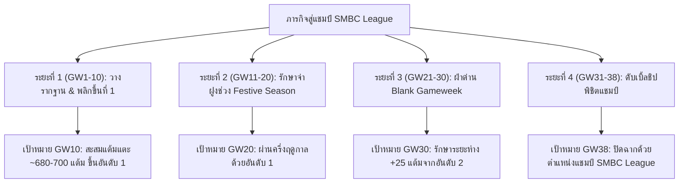

# 🏆 แผนยุทธศาสตร์ 4 ระยะสู่แชมป์ SMBC LEAGUE 2026-27
**ทีม:** Keekee | **ผู้จัดการทีม:** Ryu Onizuka (Team ID: `4554263`)  
**เป้าหมายหลัก:** ครองอันดับ 1 ของลีกในสัปดาห์ที่ **GW10, GW20, GW30 และคว้าแชมป์ใน GW38**

---

## 📊 สถานการณ์ตั้งต้น (Current Baseline)
* **คะแนนปัจจุบัน:** 153 คะแนน
* **คะแนนจ่าฝูง (Coach AI):** 221 คะแนน (ช่องว่าง: 68 คะแนน)
* **ข้อได้เปรียบชี้ขาดของเรา:**
  1. ✅ **ชิปอยู่ครบ 100%:** Wildcard 1, Wildcard 2, Triple Captain, Bench Boost, Free Hit (ในขณะที่อันดับ 1 เผา Triple Captain ทิ้งไปแล้ว!)
  2. 💰 **งบประมาณคงเหลือในคลัง (In the Bank):** £0.5m
  3. 🛡️ **แนวรับอัปเกรดเรียบร้อย:** ดึง **Riccardo Calafiori (ARS - 22 แต้ม)** เข้ามาผนึกกำลังกับ Guéhi

---

## 🗺️ แผนแม่บท 4 ระยะ (4-Phase Master Roadmap)

---

## 📍 ระยะที่ 1: GW1 - GW10 (10 สัปดาห์แรก) — "The Overtake Sprint"
🎯 **เป้าหมาย:** ทลายช่องว่าง 68 แต้ม และ **ก้าวขึ้นสู่อันดับ 1 ของ SMBC League ในสัปดาห์ที่ 10!**

* **กลยุทธ์ลดช่องว่างสัปดาห์ละ 10-12 คะแนน:**
  1. **GW4 - GW5 (เก็บเกี่ยวโปรแกรมทอง):**  
     - เชลซี (João Pedro, Rogers, Colwill) เปิดบ้านเจอ ฮัลล์ (FDR: 2)
     - ลิเวอร์พูล (Szoboszlai) เล่นในบ้านเจอ ฟูแล่ม (FDR: 2)
     - ไบรท์ตัน (Verbruggen) เยือน โคเวนทรี (FDR: 2)
     - อาร์เซนอล (Saka, Calafiori) เยือน ซันเดอร์แลนด์ (FDR: 3)
  2. **GW6 - GW8 (จุดเปลี่ยนสำคัญ: Wildcard 1):**  
     - ช่วงตลาดซื้อขายจริงปิดสมบูรณ์ และมีพักเบรกทีมชาติ
     - ใช้ **Wildcard 1** รื้อโครงสร้างทีมรอบเดียว ปลดปล่อยตัวเจ็บ/สำรองที่ไม่จำเป็น และดึงผู้เล่นฟอร์มฮอตที่โปรแกรมกำลังจะเข้าสู่ช่วงสีเขียว
  3. **การเงินและการย้ายตัว:**  
     - ใช้เงินทอน £0.5m สลับอัปเกรดแดนกลาง (เช่น Rayan ➔ Ødegaard / Mbeumo)
* 🏁 **Checkpoint GW10:** ก้าวขึ้นสู่อันดับ 1 ของ SMBC League ด้วยคะแนนสะสมประมาณ **680 - 700 คะแนน**

---

## 📍 ระยะที่ 2: GW11 - GW20 (10 สัปดาห์ถัดไป) — "Festive Consolidation"
🎯 **เป้าหมาย:** ครองจ่าฝูงและ **จบครึ่งแรกของฤดูกาลด้วยอันดับ 1 ในสัปดาห์ที่ 20!**

* **ความท้าทาย:** ช่วง Boxing Day & โปรแกรมชุกเตะสัปดาห์ละ 2 นัด มีการโรเตชั่นนักเตะสูง
* **กลยุทธ์สำคัญ:**
  1. **สร้างม้านั่งสำรองที่ลงเล่นจริง:** ด้วยการปรับทีมจาก Wildcard 1 ม้านั่งสำรองทั้ง 4 คนต้องเป็นตัวจริงของสโมสร เพื่อให้ระบบ Auto-Sub ทำงานเมื่อตัวหลักโดนพัก
  2. **ความเฉียบขาดในการเลือกกัปตัน (Haaland / Saka):** ไม่สลับกัปตันมั่วซั่ว เน้นชัวร์ตามค่า xG/xA และโปรแกรมในบ้าน
  3. **สะสม Free Transfers:** พยายาม Roll Transfer ให้มี 2 FTs เสมอเพื่อรับมือกับอาการบาดเจ็บช่วงหน้าหนาว
* 🏁 **Checkpoint GW20:** ครองอันดับ 1 ของ SMBC League ในช่วงกลางฤดูกาล

---

## 📍 ระยะที่ 3: GW21 - GW30 (10 สัปดาห์ถัดไป) — "Navigating the Blanks"
🎯 **เป้าหมาย:** ผ่านสมรภูมิสัปดาห์เกมขาด (Blank Gameweek) และ **ยึดอันดับ 1 เหนียวแน่นในสัปดาห์ที่ 30!**

* **ความท้าทาย:** บอลถ้วย FA Cup และ Carabao Cup ทำให้มีหลายทีมไม่มีแข่งในลีก (Blank Gameweek - มักเกิดช่วง GW28-GW29)
* **กลยุทธ์สำคัญ:**
  1. **ใช้ชิป Free Hit (FH):** ในสัปดาห์ Blank Gameweek ที่ทีมใหญ่ลงแข่งแค่ 3-4 คู่ เราจะกด **Free Hit** จัดทีมเฉพาะกิจ 11 คนเต็มสนาม  
     *(ในขณะที่คู่แข่งทั่วไปจะเหลือตัวลงเล่นแค่ 5-6 คน เราจะทิ้งห่างได้ 25-40 แต้มในสัปดาห์เดียว!)*
  2. **เตรียมโครงสร้างทีมรับมือ Double Gameweek:** เริ่มวางแผนตัวผู้เล่นที่มีโปรแกรมแข่งตกค้าง 2 นัด
* 🏁 **Checkpoint GW30:** นำอันดับ 2 อย่างน้อย 20 - 30 คะแนน

---

## 📍 ระยะที่ 4: GW31 - GW38 (8 สัปดาห์สุดท้าย) — "The Championship Finish"
🎯 **เป้าหมาย:** ปล่อยหมัดเด็ดชิปชุดคู่ และ **คว้าถ้วยแชมป์ SMBC League ในสัปดาห์ที่ 38!**

* **ไพ่ตายชี้ขาดแชมป์ (ไม้ตายที่เรามี แต่อันดับ 1 ไม่มี!):**
  1. **ชิป Wildcard 2 (GW33):** รื้อทีมจัดเต็ม 15 คนที่การันตีว่าได้ลงเตะ **Double Gameweek (เตะ 2 นัดใน 1 สัปดาห์)**
  2. **ชิป Bench Boost (GW34 หรือ GW37):** เปิดใช้ Bench Boost ในสัปดาห์ Double Gameweek นับแต้มครบ 15 คน (30 นัดเตะ!)  
     *(กวาดคะแนนสัปดาห์เดียวทะลุ 120 - 150+ แต้ม!)*
  3. **ชิป Triple Captain (คูณ 3):** ใส่ให้ Haaland หรือ Saka ในสัปดาห์ Double Gameweek ที่เตะ 2 นัดในบ้าน  
     *(กวาดเพิ่มอีก 60 - 75+ แต้ม ในขณะที่ Coach AI เสียชิปนี้ไปแล้วตั้งแต่ GW3 ได้ไปแค่ 9 แต้ม!)*
* 🏁 **Checkpoint GW38:** **ฉลองตำแหน่งแชมป์ SMBC LEAGUE 2026-27 อย่างสมบูรณ์แบบ! 🏆🥇**
